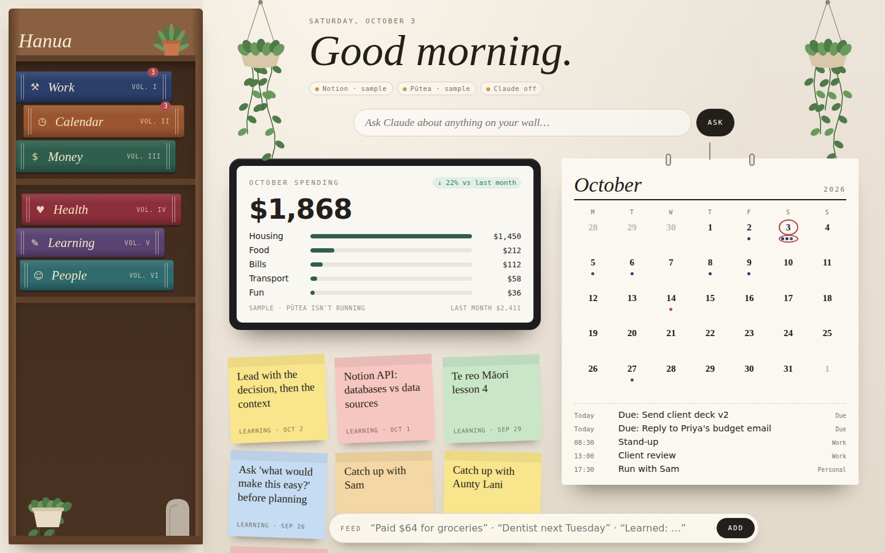
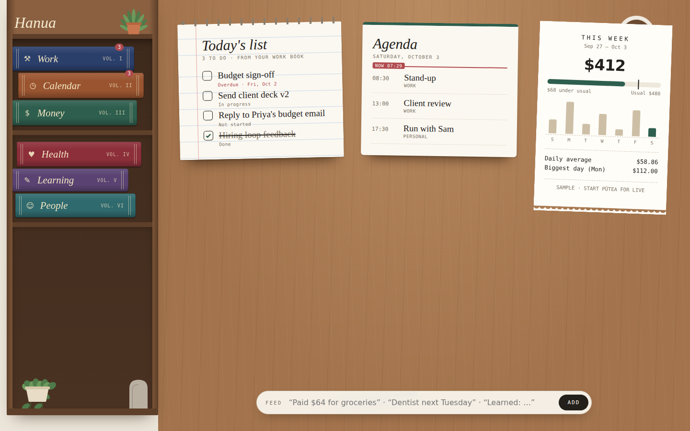

# Hanua

A personal daily dashboard that looks like a room.

- **Bookcase (left):** your menu. Each book is a Notion database you can open to read and ask about. Money opens your Pūtea spending.
- **The wall:** this month's spending from Pūtea on a wall-mounted screen, a real wall calendar with upcoming events, and sticky notes (recent learnings, people you haven't caught up with, blocked work).
- **The table (scroll down):** today's checklist (tick tasks off and they're marked Done in Notion), today's agenda with a "now" line, and this week's spending against your usual week.
- **Claude** answers questions from the wall or inside any book, and the Feed bar files a quick note into the right Notion database after you confirm it.

Money comes from [Pūtea](https://github.com/merlanomagah/putea), which syncs your bank accounts through Akahu. Keep Pūtea running and Hanua reads its local API; without it, Hanua shows sample spending.




It runs with sample data straight away, so you can try it before connecting anything.

## Run it

| # | Step | Command / where |
|---|------|-----------------|
| 1 | Install Node 20+ | https://nodejs.org |
| 2 | Install dependencies | `npm install` |
| 3 | Start it (sample data) | `npm start`, then open http://localhost:3000 |

## Start it with a double-click (Mac)

| # | Step |
|---|------|
| 1 | Double-click **Start Hanua** in the folder. It installs packages if needed, starts Hanua in the background and opens it in your browser. |
| 2 | Run it again any time: if Hanua is already running it just opens the page. |
| 3 | **Stop Hanua** shuts it down. Logs are in `logs/hanua.log`. |

The first time, macOS may say it can't verify the file: right-click it, choose **Open**, then **Open** again.

### Keyboard shortcut

| # | Step |
|---|------|
| 1 | Open the **Shortcuts** app → **Settings → Advanced** → turn on **Allow Running Scripts** |
| 2 | **File → New Shortcut**, name it "Hanua" |
| 3 | Add the action **Run Shell Script** and replace its text with the full path to the script, e.g. `"$HOME/Documents/GitHub/hanua/scripts/start.sh"` |
| 4 | Click the **ⓘ** (Shortcut details) → **Add Keyboard Shortcut** → press your keys, e.g. ⌃⌥H |

## Connect Notion

| # | Step | Details |
|---|------|---------|
| 1 | Create an integration | https://www.notion.so/my-integrations → *New integration* → copy the secret |
| 2 | Add the secret | `cp .env.example .env`, then set `NOTION_TOKEN=` |
| 3 | Share each database with it | Open the database in Notion → `•••` → *Connections* → add your integration. Skip this and you get a 404. |
| 4 | Copy each database ID | It's the 32-character ID in the database URL: `notion.so/<workspace>/`**`2f1c…9ab`**`?v=…` |
| 5 | Map it to a book | Paste it into `notionDatabaseId` for that area in `config/areas.json` |
| 6 | Match column names | Set `fields` to your column names: `title`, `date`, `amount` (optional), `status` (optional) |
| 7 | Restart | `npm start`. The pill top-right shows how many books are live. |

## Connect Claude

| # | Step | Details |
|---|------|---------|
| 1 | Get an API key | https://console.anthropic.com |
| 2 | Add it | `ANTHROPIC_API_KEY=` in `.env`, then restart |

Uses `claude-opus-5-5` by default. Override it with `CLAUDE_MODEL` in `.env`.

## Customise the shelf

`config/areas.json` controls everything:

- **Add a book:** add an object to `areas` (`id`, `label`, `icon`, `color`, `notionDatabaseId`, `fields`).
- **Spine colour:** `color`. Deep, desaturated colours look most like real bindings.
- **Heading:** `centre.title`.
- **Summary stat:** `summary` sets the fourth stat in a book: `"total"` (e.g. savings), `"per-month"` (subscriptions; yearly/weekly plans are converted using the status column), or leave it out for net over the last 30 days.

Spine thickness grows with the number of entries. "Lv" is activity: how many entries fall within 30 days of today.

## How it fits together

```
browser (public/)  ──►  server/index.js  ──►  Notion API   (your databases)
  shelf, book, tree        holds the keys   └►  Claude API   (ask + feed)
```

- Keys stay on the server, which only listens on `127.0.0.1`. Nothing secret reaches the browser.
- **Feed has two steps.** Claude drafts the row, you check or edit it in a dialog, and only then is it written to Notion.
- **Privacy:** "Ask" sends that book's entries (or every book's, for the main search) to the Claude API.
