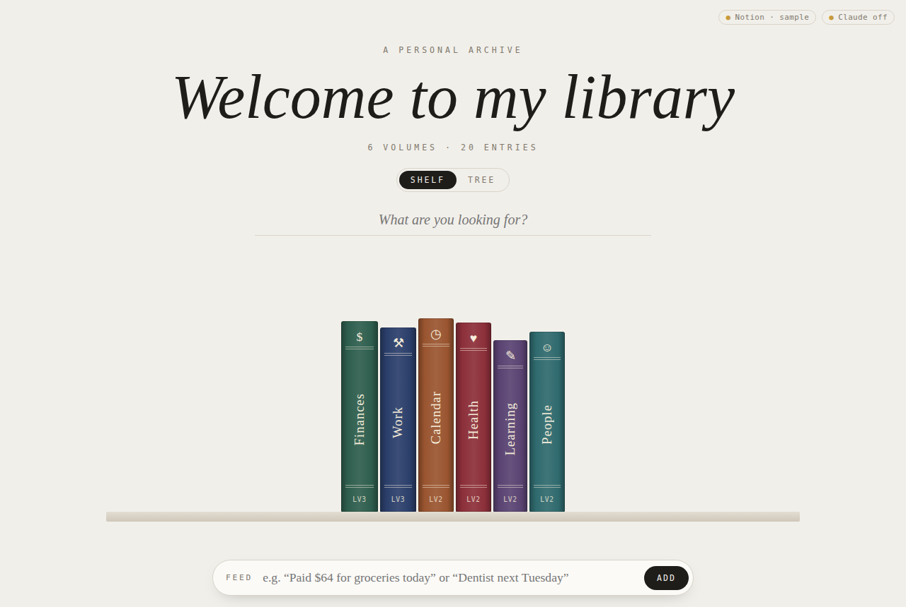
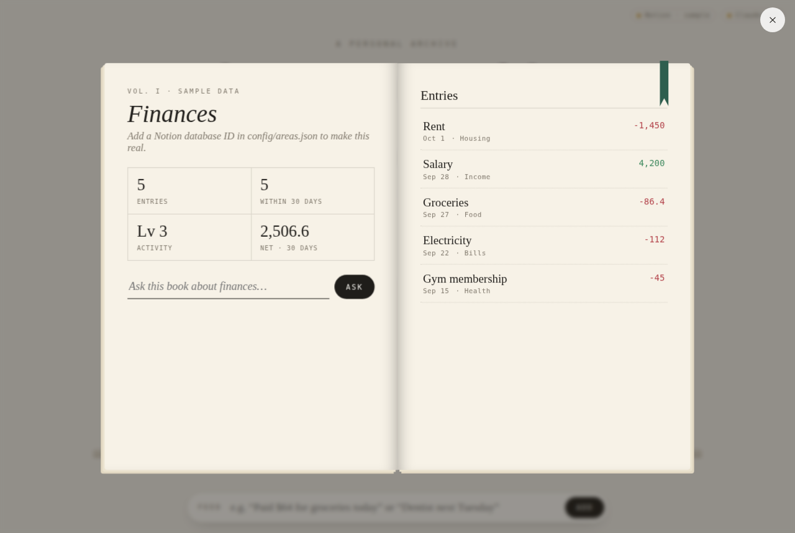

# Hanua

A personal "library" dashboard. Each area of your life (Finances, Work, Calendar, …) is a book on a shelf.
Click a spine and the book slides off the shelf, turns to face you and opens. The left page has stats and an
"Ask this book" box. The right page lists your entries.

- **Data** comes from your Notion databases, one database per book.
- **Claude** answers questions about a book (or the whole library) and files quick notes into the right database ("Feed").
- A **Tree** view shows the same areas as a radial skill tree. Its nodes open the same books.




It runs with sample data straight away, so you can try it before connecting anything.

## Run it

| # | Step | Command / where |
|---|------|-----------------|
| 1 | Install Node 20+ | https://nodejs.org |
| 2 | Install dependencies | `npm install` |
| 3 | Start it (sample data) | `npm start`, then open http://localhost:3000 |

## Connect Notion

| # | Step | Details |
|---|------|---------|
| 1 | Create an integration | https://www.notion.so/my-integrations → *New integration* → copy the secret |
| 2 | Add the secret | `cp .env.example .env`, then set `NOTION_TOKEN=` |
| 3 | Share each database with it | Open the database in Notion → `•••` → *Connections* → add your integration. Skip this and you get a 404. |
| 4 | Copy each database ID | It's the 32-character ID in the database URL: `notion.so/<workspace>/`**`2f1c…9ab`**`?v=…` |
| 5 | Map it to a book | Paste it into `notionDatabaseId` for that area in `config/areas.json` |
| 6 | Match column names | Set `fields` to your column names: `title`, `date`, `amount` (optional), `status` (optional) |
| 7 | Restart | `npm start`. The pill top-right shows how many books are live. |

## Connect Claude

| # | Step | Details |
|---|------|---------|
| 1 | Get an API key | https://console.anthropic.com |
| 2 | Add it | `ANTHROPIC_API_KEY=` in `.env`, then restart |

Uses `claude-opus-5-5` by default. Override it with `CLAUDE_MODEL` in `.env`.

## Customise the shelf

`config/areas.json` controls everything:

- **Add a book:** add an object to `areas` (`id`, `label`, `icon`, `color`, `notionDatabaseId`, `fields`).
- **Spine colour:** `color`. Deep, desaturated colours look most like real bindings.
- **Heading:** `centre.title`.
- **Summary stat:** `summary` sets the fourth stat in a book: `"total"` (e.g. savings), `"per-month"` (subscriptions; yearly/weekly plans are converted using the status column), or leave it out for net over the last 30 days.

Spine thickness grows with the number of entries. "Lv" is activity: how many entries fall within 30 days of today.

## How it fits together

```
browser (public/)  ──►  server/index.js  ──►  Notion API   (your databases)
  shelf, book, tree        holds the keys   └►  Claude API   (ask + feed)
```

- Keys stay on the server, which only listens on `127.0.0.1`. Nothing secret reaches the browser.
- **Feed has two steps.** Claude drafts the row, you check or edit it in a dialog, and only then is it written to Notion.
- **Privacy:** "Ask" sends that book's entries (or every book's, for the main search) to the Claude API.
